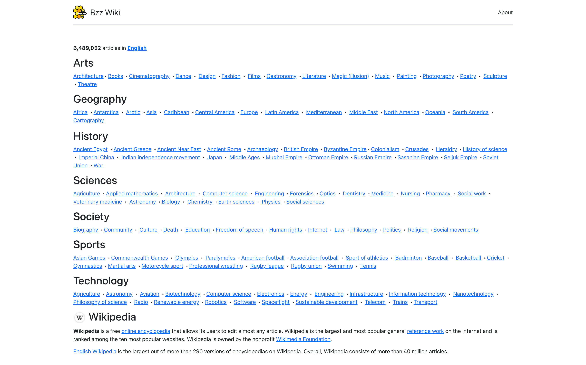

# Swarm Wiki

Swarm Wiki - project for uploading wikipedia pages to the Swarm decentralized network. The project uses ZIM archives with articles as a data source, forms pages ready for viewing in a browser, and uploads them to the network using Bee node.

The main objective of this project is to build a solution with an architecture that allows not only uploading a static Wikipedia to swarm. This solution allows third-party contributors to make changes to certain articles without downloading gigabytes of data. Such changes will be stored and managed in the contributor's address space.

After creating an interface for such actions, this solution can be used to build a complete analogue of Wikipedia with contributors and alternative opinions on various articles. With this approach, you can switch between different viewpoints easily.



Demo: https://bzzwiki.xyz/

Video demo: https://youtu.be/tCx_UVl90As

Project web interface is accessible locally (after running [Bee node](https://github.com/ethersphere/bee) or [Swarm Desktop](https://desktop.ethswarm.org/)) by the url

`http://bzzwiki.eth.swarm.localhost:1633/`

and without Bee node

`https://bzzwiki.bzz.link/`

** **Important** **

If you are interested in reading about each service individually and in general about my experience in developing these services, then I recommend that you look into the experience I described. It describes not only the development process, but also future approaches to make data access on SWARM more convenient.

https://docs.google.com/document/d/1ABMRlWgaz3N41ARn2K34OuEyZ48OEOW1j6vukBD3SYQ/edit

# How to deploy the project?

Before you follow the instructions for deploying the project, you can watch a video with all the steps: https://www.youtube.com/watch?v=YkUr01lAykQ

Tested on Ubuntu 20.04.4 LTS

Make sure the system is up to date

`sudo apt-get update && sudo apt-get upgrade -y`

Install Docker

`curl -fsSL https://get.docker.com -o get-docker.sh && sudo sh get-docker.sh`

Clone the project

`git clone git@github.com:igar1991/swarm-wiki.git`

Create directories to store node data and Redis

`mkdir bee-wiki && chmod 0777 bee-wiki && mkdir wiki-redis && chmod 0777 wiki-redis`

Go to project

`cd swarm-wiki`

Copy example of environment file to the root and fill all required fields. Every field is well described

`cp env.example .env`

Build all Docker containers

`./build-all.sh`

Let's set up the firewall. Open ports for data exchange and close ports for service management

`sudo ufw allow ssh && sudo ufw allow 1634 && sudo ufw deny 1633 && sudo ufw deny 1635 && sudo ufw deny 6379 && sudo ufw deny 8001 && sudo ufw enable`

Start Bee node

`docker compose up bee`

Copy node address from logs (in the video you can see how to do it) and fund it with 0.1 xDai and at least 1 BZZ on Gnosis Chain network.

Wait 15-30 minutes to sync.

If you deposited 1 BZZ, then run this command to withdraw tokens to buy stamps. If you deposited 1.6 BZZ or more, then you can not do this.

Withdraw 0.6 BZZ from chequebook before buying

`curl -X POST http://localhost:1635/v1/chequebook/withdraw?amount=6000000000000000`

Then after 1 minute create a stamp for ~549.76 GB, 1.2 years. You can decrease or increase the parameters by following the documentation https://docs.ethswarm.org/docs/access-the-swarm/keep-your-data-alive/

`curl -X POST http://localhost:1635/v1/stamps/30000000/27`

Wait few minutes after buying to activate stamps.

Done! You can start all services in background with command

`docker compose up -d`

You can check logs with command

`docker compose logs -f --tail 100`

# Reuploading

Because everything is pinned locally you can reupload all chunks this way.

Install NodeJS

`curl -sL https://deb.nodesource.com/setup_16.x -o /tmp/nodesource_setup.sh`

`sudo bash /tmp/nodesource_setup.sh`

`sudo apt install nodejs`

Install swarm-cli

`npm install --global @ethersphere/swarm-cli`

Reupload

`swarm-cli pinning reupload-all`

## How to build docker containers separately

Build any docker package from the root of the project. Example for trigger container

`docker build -t swarm-wiki-trigger -f docker/trigger/Dockerfile . `

Run the package with specific .env

`docker run --env-file .env swarm-wiki-trigger`

# DB format description

Keys under `wiki_page_en_TITLEKEY` are keys that stores info for page title as key. Here stored info about full pages and redirects.

Here stored information only about **uploaded** pages. They could be full pages or redirects. It is detectable by stored metadata.

```json
{
  "topic": "bc25fa531672e8d8d3e69082d6ad8fc1abfd2457dd9116baa65fa9d762c68dc8",
  "feedReference": "cde1cfa6814bb890e15585f9bbb785aa59dfcad0b1d178e6fd8327d271b4fa24",
  "uploadedData": {
    "reference": "ad31a1249bfd6502c81277ed260ae40c073219af84caf760aca059f8a17f9e1e"
  },
  "meta": {
    "key": "US",
    "path": "A/US",
    "type": "redirect",
    "title": "US",
    "index": "3415",
    "internal_type": "redirect",
    "redirect_index": "3481",
    "filename": "wikipedia_en_100_maxi_2022-06.zim"
  },
  "updated_at": 1657370955
}
```

Keys `wiki_page_index_wikipedia_en_FILENAME_INDEX` stored info tied to title index (titles retrieved by zimdump tool).

This info required for fast checking if some title index was processed or not without using zimdump.

This info stored in the same time as title above. It means that pages already uploaded.

```json
{
  "meta": {
    "key": "United_States_president",
    "path": "A/United_States_president",
    "type": "redirect",
    "title": "United States president",
    "index": "3520",
    "internal_type": "redirect",
    "redirect_index": "2725",
    "filename": "wikipedia_en_100_maxi_2022-06.zim"
  },
  "updated_at": 1657370954
}
```

Keys `cache_wikipedia_en_FILENAME_ZIMINDEX` for real ZIM indexes. It is necessary for converting redirects to real pages without using zimdump.

Here stored info only about pages, not redirects. But there is no guarantees that pages uploaded to the network. They could appear here before uploading.

```json
{
  "key": "Amphibian",
  "path": "A/Amphibian",
  "type": "page",
  "title": "Amphibian",
  "index": "235",
  "internal_type": "item",
  "mime_type": "text/html",
  "item_size": "320968"
}
```

## DB management

Redis database management tool. With it, you can search, view, delete and edit any page entries.

`http://localhost:8001/redis-stack/browser`

## Experimental

The first approach uploads data using many nodes, and this experimental approach is used to upload data using 1 large and powerful server, in which all data is retrieved and ready to upload.

This approach can be useful for optimizing data upload costs. In some cases, buying 1 powerful server can be cheaper than buying many small ones.

To run an extractor-2 that works on the full set of pre-extracted data, use command

`docker compose -f docker-compose-v2.yml up -d`
